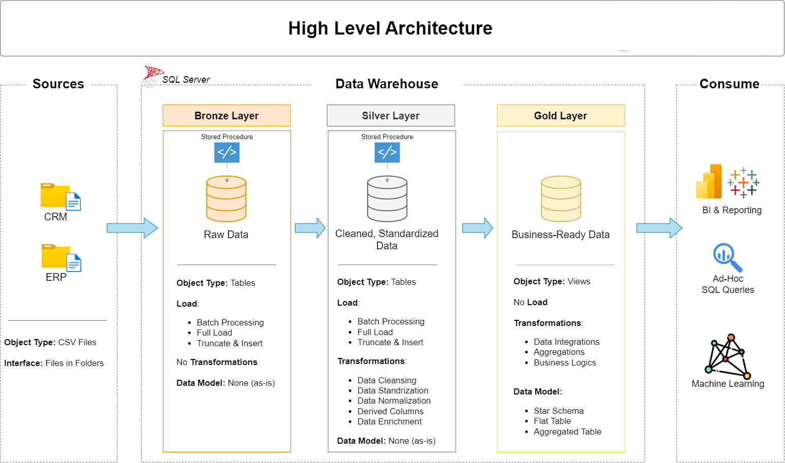

# SQL Data Warehouse & Analytics Project

A complete **data warehousing + analytics** solution built with SQL Server, from raw ingestion to insightful reporting.

---

## 🏗️ Architecture & Design

This project employs a **Medallion / Layered** architecture:

* **Bronze Layer** → Ingest raw data exactly as received (CSV → staging tables)
* **Silver Layer** → Cleanse, standardize, dedupe, and transform data
* **Gold Layer** → Business-ready data in a **star schema** (fact + dimensions) for analytics

The diagram below visualizes how data flows through these layers:


---

## 📋 Project Overview

This repository consists of two major components:

1. **Data Engineering / ETL & Warehouse**

   * CSV ingestion, transformations, and modeling
   * Building dimension/fact tables suited for analytics

2. **Analytics / SQL Reporting & Exploration**

   * Structured SQL scripts to explore, analyze, and report on the warehouse
   * Insights into customers, products, sales, and trends

This makes the project truly **end-to-end**, covering both backend data engineering and frontend analytics.

---

## 🛠️ Tech Stack & Tools

* **SQL Server Express / Full** — Data warehouse engine
* **SQL Server Management Studio (SSMS)** — SQL execution, query workbench
* **CSV / flat files** — Source data (ERP, CRM)
* **DrawIO** — Architecture, flow, and model diagrams
* **Git / GitHub** — Version control and collaboration

---

## 📂 Repository Structure

```
sql-data-warehouse-project/
│
├── datasets/                           # Raw source CSV files (ERP, CRM )
│
├── docs/                               # Documentation & visuals
│   ├── data_integration.png                     # ETL pipeline diagram
│   ├── data_architecture.png       # Architecture / layering design
│   ├── data_catalog.md                 # Data dictionary / field definitions
│   ├── data_flow.png                # Data movement & dependencies
│   ├── data_models.png              # Star schema / ER diagrams
│   ├── naming-conventions.md           # Standards for naming tables, columns etc.
│
├── scripts/                            # SQL scripts
│   ├── bronze/                         # Ingestion / staging scripts
│   ├── silver/                         # Data cleaning & transformation scripts
│   ├── gold/                           # Schema building & fact/dimension creation
│   ├── analytics/                      # SQL scripts for business reporting & analytics
│       ├── 01_database_exploration.sql       # Overview of tables, row counts, schema stats
│       ├── 02_dimensions_exploration.sql     # Explore dimension tables’ contents & quality
│       ├── 03_date_range_exploration.sql     # Filtering and slicing by date/time
│       ├── 04_measures_exploration.sql       # Analyzing key measures (revenue, sales, etc.)
│       ├── 05_magnitude_analysis.sql         # Magnitude / distribution of measures
│       ├── 06_ranking_analysis.sql           # Top-N analysis for customers/products/regions
│       ├── 07_change_over_time_analysis.sql  # Trend & period-over-period change analyses
│       ├── 08_cumulative_analysis.sql        # Running sums, cumulative metrics over time
│       ├── 09_performance_analysis.sql       # KPI dashboards, comparisons
│       ├── 10_data_segmentation.sql          # Customer / product segmentation by behavior
│       ├── 11_part_to_whole_analysis.sql     # Contribution / share analyses (part-to-whole)
│       ├── 12_report_customers.sql           # Final customer-level reporting view & metrics
│       ├── 13_report_products.sql            # Final product-level reporting view & metrics
│       └── …                                 # Additional analytical scripts as needed
│    ├── init_database.sql
├── tests/                              # Quality checks, assertions, or validation queries
│
├── README.md                           # Project overview & instructions
```

---

## 📈 Analytics & Insights Overview

Using the `analytics/` scripts, here are some of the business insights you’ll find:

* **Customer Behavior**

  * Top customers by total spend
  * Churn/retention analyses
  * Segmentation by purchase frequency, recency, and value

* **Product Performance**

  * Best-selling and underperforming products
  * Category-level contribution to revenue

* **Sales Trends & Growth**

  * Monthly / annual trend analyses
  * Period-over-period growth comparisons
  * Cumulative growth & lifetime metrics

* **Detailed Reports**

  * Customer-level summary tables
  * Product-level rating and performance dashboards

---


## 🎯 Why This Project Stands Out

* Demonstrates an **end-to-end pipeline**: from raw ingestion to business insights
* Separation of concerns: ingestion (bronze), transformation (silver), analytics (gold + reporting)
* Modular & reusable SQL scripts for analytics + reporting
* Easily extensible: add more dimensions, metrics, or analytics scripts
* Clear documentation and visual diagrams to support understanding

---

## 📬 Stay Connected

Created by **Saishrita Mohapatra**

* [GitHub](https://github.com/Saishrita)
* [LinkedIn](https://www.linkedin.com/in/saishrita-mohapatra-10a943272/)


